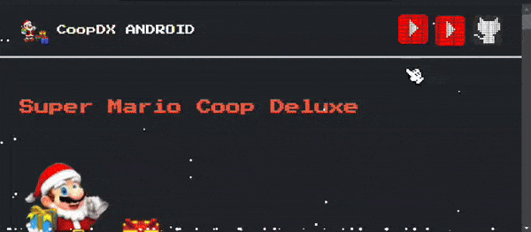

# sm64coopdx-android

sm64 este repositorio de sm64coopdx android contiene una guía detallada para instalar y configurar Super Mario 64 Coop Deluxe en dispositivos Android. Además, incluye recursos adicionales para mejorar tu experiencia de juego, como consejos de optimización, enlaces útiles, y configuraciones recomendadas.
______________________________________

______________________________________

> [!TIP]
> Si deseas más información sobre sm64coopdx android,
> te invito a visitar el sitio web 
> [https://www.sm64coopandroid.online/](https://www.sm64coopandroid.online/)

**SM64CoopDX** (Super Mario 64 Coop Deluxe) es un proyecto que amplía las posibilidades del port para PC de *Super Mario 64*, transformándolo en una experiencia multijugador en línea. Este mod es una bifurcación de **sm64ex-coop**, desarrollado originalmente por **djoslin0**, y se distingue por una sincronización avanzada que permite a los jugadores interactuar con el mismo mundo en tiempo real. A continuación, desgloso los principales aspectos del proyecto:

### Características principales:
1. **Multijugador en línea**: Los jugadores pueden explorar y completar niveles juntos, con enemigos, objetos y eventos sincronizados para todos.
2. **Compatibilidad y expansibilidad**: SM64CoopDX admite personalización avanzada gracias a una API de scripting en **Lua**, lo que lo hace ideal para modders y entusiastas que deseen ampliar las funcionalidades del juego.
3. **Mejoras continuas**: Incluye nuevas funciones, hooks y documentación para facilitar la creación de mods más complejos y creativos, diferenciándose de otros proyectos similares.

### Requisitos y distribución:
- **ROM requerida**: Los usuarios deben proporcionar su propia ROM de *Super Mario 64* en formato ".z64".
- **Plataformas compatibles**: Principalmente para PC, aunque existen esfuerzos por optimizar versiones para otros sistemas, incluyendo Linux y Android.
- **Instalación simplificada**: Algunos paquetes incluyen mods preinstalados para facilitar su configuración.

### Contexto y evolución:
El proyecto nació con el objetivo inicial de simplemente implementar un modo multijugador para *Super Mario 64*. Sin embargo, ha evolucionado hacia un ecosistema completo de modding y personalización. Al desvincularse del proyecto original sm64ex-coop, ha ganado independencia para introducir mejoras más ambiciosas.

Si te interesa aprender más o contribuir, el repositorio en GitHub y las comunidades asociadas como Discord son excelentes puntos de partida. 

Puedes ver un tráiler oficial del proyecto en . 
[https://youtu.be/HvFm4GcBlGs](https://youtu.be/HvFm4GcBlGs?si=sQ05SzWEwCrIhfCj)
